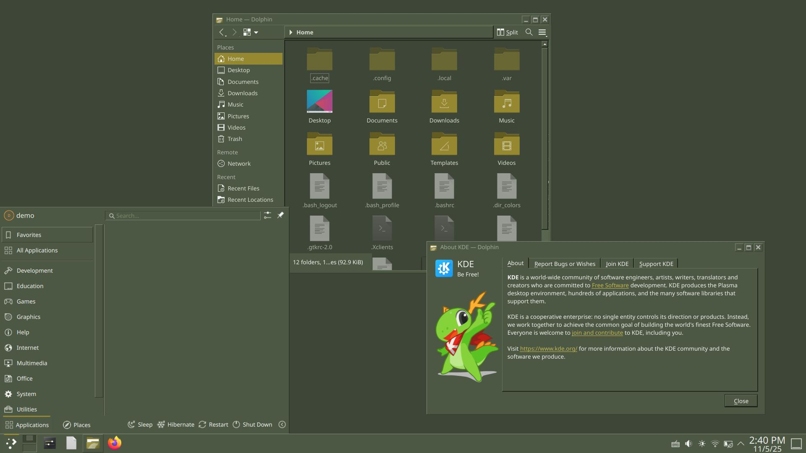
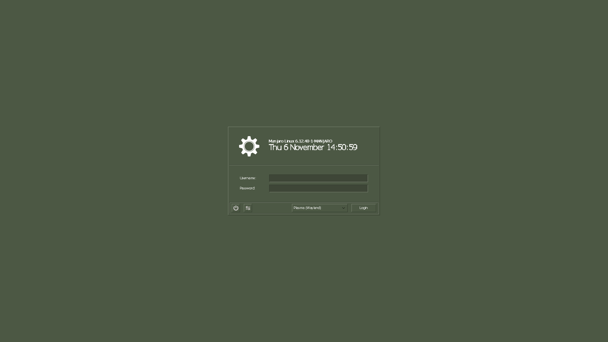

# Steamed

A global theme for KDE Plasma designed to give the appearance of Steam's 2003 version, Half-Life's VGUI scheme, or Counter-Strike 1.6's VGUI theme (they're all the same thing).  
These were all created for my personal use but I figure there's probably someone else out there who might also want to use it.
## Screenshots

## Credits
Window decoration based on PixelOCDGuy's Windows 98 Window Decoration https://github.com/pixelocdguy/windows-classic.  
Plasma style based on ABGR's QTStep Classic https://www.opencode.net/abgr/qtstep.  
SDDM Theme based on phob1an's Reactionary KDE1 https://www.opencode.net/phob1an/reactionary.  
WineTahomaBit is a ttf conversion of Xenthio's WineTahomaBit font which can be downloaded here https://github.com/ungstein/OG-Steam/files/7207148/WineTahomaBit.zip. This font uses GPLv2.1.  
